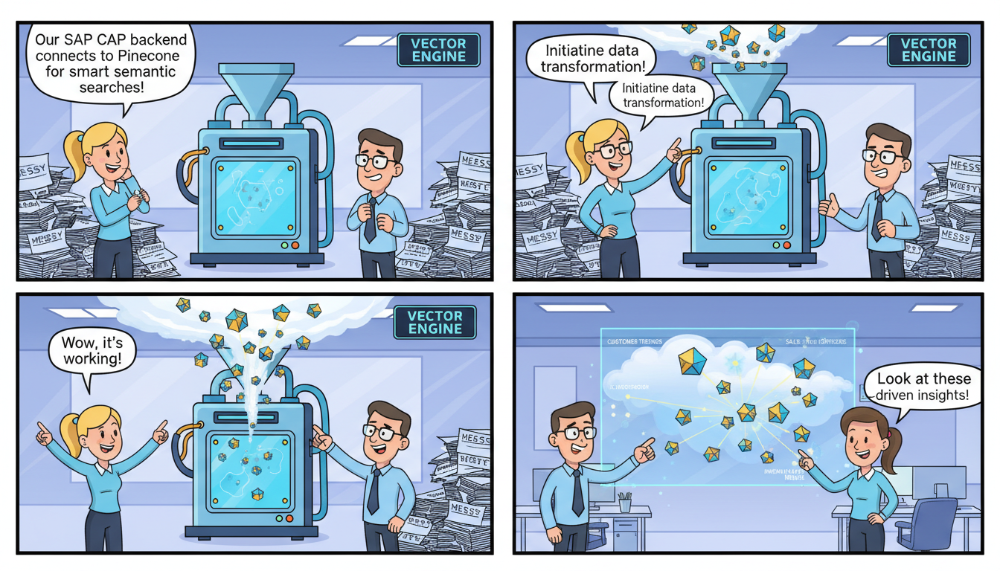

# Vector Engine CAP Backend

[](https://cap.cloud.sap/docs/)
[](https://nodejs.org/)
[](https://www.pinecone.io/)

`vector-engine-cap` is a robust backend service built using the **SAP Cloud Application Programming Model (CAP)**. It serves as the core orchestration layer for the Vector Engine Fiori Application, integrating **Pinecone** for vector database management and **OpenAI** for generating embeddings and AI-driven insights.

This project enables advanced semantic search, data indexing, record comparison, and statistical analysis within the SAP BTP ecosystem.

---

## 🚀 Features

-   **Vector Indexing**: Seamlessly transform structured/unstructured data into embeddings and upsert them to Pinecone.
-   **Semantic Search**: Perform high-performance vector-based searches to find contextually relevant information.
-   **Record Comparison**: Advanced algorithms to compare multiple records using vector distance and attribute analysis.
-   **Analytics & Statistics**: Specialized service to calculate and visualize distribution and trends within the vector space.
-   **Filtering Engine**: Hybrid search capabilities combining traditional metadata filtering with vector similarity.
-   **AI Integration**: Built-in utility to run AI assistant tasks and manage embedding generation via OpenAI.

---

## 📂 Project Structure

| Path | Description |
|------|-------------|
| `srv/` | Contains the CAP service definitions (`.cds`) and implementation logic (`.js`). |
| `srv/utils/` | Core logic for Pinecone integration, embedding generation, and comparison algorithms. |
| `srv/resources/` | Static configurations and resource metadata. |
| `mta.yaml` | Deployment configuration for SAP BTP (Cloud Foundry). |
| `xs-security.json` | Security configuration for XSUAA (Authentication/Authorization). |

---

## 🛠 Prerequisites

-   [Node.js (v18 or higher)](https://nodejs.org/)
-   [SAP CAP SDK (@sap/cds-dk)](https://cap.cloud.sap/docs/get-started/)
-   A **Pinecone** Account and API Key.
-   An **OpenAI** API Key (for embeddings).

---

## 🔧 Installation & Setup

1. **Clone the repository:**
   ```bash
   git clone <repository-url>
   cd vector-engine-cap
   ```

2. **Install dependencies:**
   ```bash
   npm install
   ```

3. **Configure Environment Variables:**
   Create a `.env` file in the root directory (do not commit this file):
   ```env
   PINECONE_API_KEY=your_pinecone_key
   PINECONE_ENVIRONMENT=your_environment
   OPENAI_API_KEY=your_openai_key
   ```

4. **Run the application locally:**
   ```bash
   cds watch
   ```
   The service will be available at `http://localhost:4004`.

---

## 🛰 Service Overview

### 1. Vector Indexer Service (`vector-indexer-service`)
Handles the ingestion of data into the Pinecone index.
*   **Action**: `upsertData` - Processes raw text, generates embeddings, and stores them.

### 2. Vector Search Service (`vector-search-service`)
The primary interface for querying the vector database.
*   **Function**: `search` - Accepts a query string, converts it to a vector, and returns the top-K nearest neighbors.

### 3. Compare Records Service (`compare-records-service`)
Evaluates similarities and differences between specific records.
*   **Implementation**: Uses `srv/utils/comparator-algorithm.js` to calculate delta scores between embeddings.

### 4. Statistics Service (`statistics-service`)
Provides data insights for Fiori Dashboards.
*   **Function**: `getStatistics` - Returns counts, average similarity scores, and category distributions.

---

## 💻 Code Examples

### Querying the Vector Search Service
You can invoke the search service via a standard OData/REST call:

```javascript
// Example of how the search logic might be called internally
const vectorSearch = await cds.connect.to('VectorSearchService');
const results = await vectorSearch.send('query', { 
    text: "Find industrial parts similar to turbine blades",
    topK: 5 
});
```

### Pinecone Integration (Utility)
The `srv/utils/pinecone-index.js` encapsulates the Pinecone client:

```javascript
import { Pinecone } from '@pinecone-database/pinecone';

const pc = new Pinecone({ apiKey: process.env.PINECONE_API_KEY });
const index = pc.index('vector-engine-index');

export const upsertVector = async (id, values, metadata) => {
    await index.upsert([{ id, values, metadata }]);
};
```

---

## 📦 Deployment

This project is ready for deployment to **SAP Business Technology Platform (BTP)**.

1. **Build the MTA archive:**
   ```bash
   mbt build
   ```

2. **Deploy to Cloud Foundry:**
   ```bash
   cf deploy mta_archives/vector-engine-cap_1.0.0.mtar
   ```

---

## 🔐 Security

The project uses `@sap/xssec` for authentication. In production, services are protected by XSUAA. Ensure your `mta.yaml` is correctly configured with the XSUAA service instance before deploying.

---

## 📝 License

Copyright (c) 2025. All rights reserved. Unlicensed.